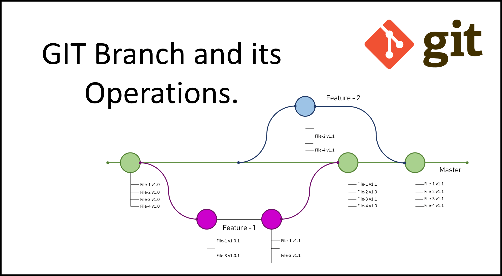
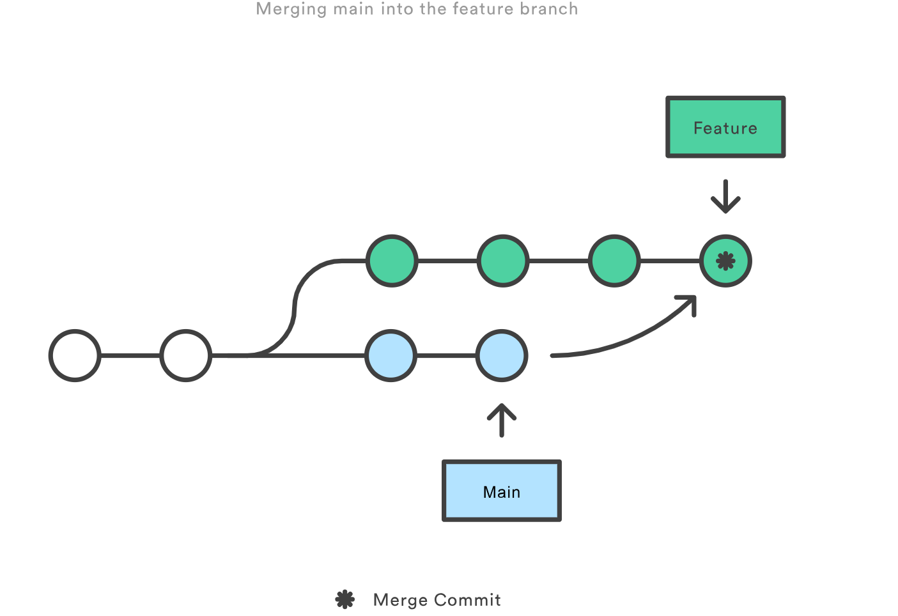
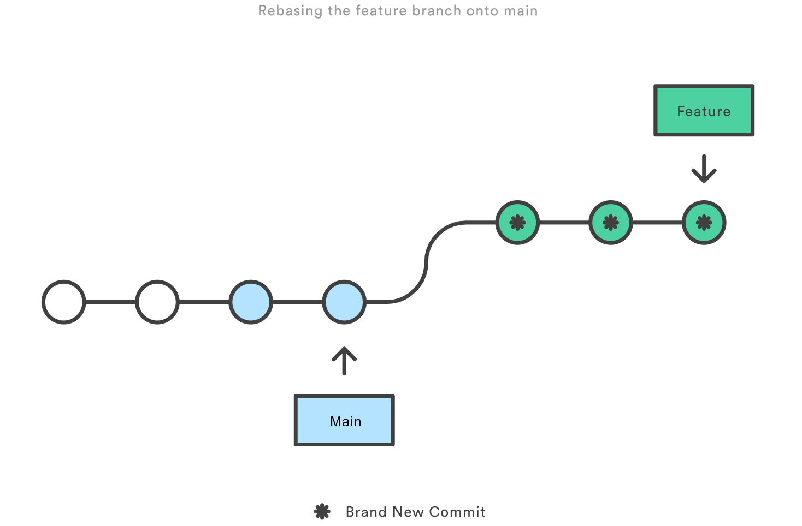

# CalendarFDM

## Table of Contents

- [Introduction](#introduction)
- [Prerequisites](#prerequisites)
- [Getting Started](#getting-started)
- [Project Structure](#project-structure)
- [Testing](#testing)
- [React](#testing)

## Introduction

Briefly describe your project and its purpose. Mention that this project follows Test-Driven Development (TDD) with Jest and implements a Clean Architecture.

## Prerequisites

1. Download Visual Studio Code 2022 from microsoft store or [from here](https://code.visualstudio.com/download)


### Retrieve the code

1. Install Git [from here](https://git-scm.com/download).
   - On Windows, use the standalone installer.
2. Open your file explorer and navigate to the file you wish to put your repository/workspace
3. Right-click somewhere in the file space then `(Right-click)->Show more options->Git Bash here` or `(Right-click)->Open in Terminal`.
4. Clone the repository
   - On GitLab, click the `Clone` button and copy the `Clone with HTTPS` link
   - Enter the following command but replace `<clone-https-link>`, including the `<>`
   - `git clone <clone-https-link> "CalendarFDM"`
   - Use your FDM GitLab account email and password

### Open the project
Once you have cloned the project, open the repository in `Visual Studio Code`, and then open a terminal using `Ctrl + Shift + '` or `Terminal -> New Terminal`

### Install the required modules
This project is written using React and uses jest to run unit tests. Please make sure you have Node.js and jest installed on your device.

## Git / Branching Strategy
[Git](https://git-scm.com/) is a free and open source distributed version control system. We use Git to keep track of changes to our codebase.

We use the [trunk-based development](https://www.atlassian.com/continuous-delivery/continuous-integration/trunk-based-development) branching strategy over the [gitflow](https://www.toptal.com/software/trunk-based-development-git-flow) strategy. This is becuase the gitflow strategy is more useful when the development team has a steady cadence of releases. However, in this project, we do not have releases or the concept of separate environments - all work is done within the local `development` environment. Trunk-based development is suited to this extremely simple workflow.

Trunk-based development can be described using the below picture (sourced from https://www.toptal.com/software/trunk-based-development-git-flow)


## Rebasing / Merging

If feature branches are longer-lived, there are likely to be situations where changes from certain feature branches are merged into the master branch after other feature branches have been cut, but before those changes have been merged, similar to the situation below:



Feature-2 was cut off the Master branch before Feature-1 was completed and merged. In this case, Feature-2 does not contain the changes from Feature-1, which may cause merge conflicts and/or unexpected functionality when Feature-2 comes in for merging into the master branch.

[Rebasing](https://git-scm.com/book/en/v2/Git-Branching-Rebasing) and [merging](https://www.atlassian.com/git/tutorials/using-branches/git-merge) are methods of including changes from a parent branch into a child branch. [They differ in how they handle the history.](https://www.atlassian.com/git/tutorials/merging-vs-rebasing). In effect, `git merge` results in a merge commit, where the history looks like this (credit to https://www.atlassian.com/git/tutorials/merging-vs-rebasing):



A `git rebase` "replays" all your commits onto the branch, re-writing the project history by creating brand new commits for each commit in the original branch (credit to https://www.atlassian.com/git/tutorials/merging-vs-rebasing):



Git rebase generally results in a cleaner history. We generally prefer using `rebase` over `merge` for this reason.

An example process of using `git rebase` and a comparison to `git merge` can be found at https://www.freecodecamp.org/news/how-to-use-git-rebase/
## Running without extensions
- Node.js: [Download and install Node.js](https://nodejs.org/)
- Make sure you have all the project dependencies installed. If you haven't already, you can install them using npm:

```sh
npm install
```

- Jest: Install Jest globally or as a dev dependency using npm.

```sh
npm install --save-dev jest
```

## Getting Started

To run the project, navigate to the project directory and run the command in the terminal that you have opened:

```sh
npm start
```
which will open up the calendar at the address [http://localhost:5500]


## Project Structure

The project structure follows the Clean Architecture pattern, designed to provide a clear separation of concerns and maintainability. Each layer has a specific responsibility, making it easier to test, extend, and maintain the application.

### Presentation Layer (`src/main/presentation`)

This layer contains user interface components and application controllers. It's responsible for handling user input, rendering views, and interacting with the user. In a web application, this could include your frontend code.

### Use Cases (Business) Layer (`src/main/useCases`)

The use cases layer holds the business logic of the application. Use cases represent specific actions or features of your application. They orchestrate the flow of data and operations while keeping the domain entities clean from application-specific details.

### Domain Layer (`src/main/entities`)

The domain layer defines the core entities and business rules of your application. These entities should be independent of any specific technology or framework. They encapsulate the business logic and state of your application.

### Data Access Layer (`src/main/dataAccess`)

The data access layer is responsible for interacting with external data sources, such as databases, APIs, or file systems. It abstracts the details of data retrieval and storage, ensuring that the rest of the application remains agnostic to the data source.

### Configuration (`src/config`)

This directory contains configuration files and settings that the application requires. It's essential for keeping configuration separate from the application logic.

### Additional Directories
This project structure allows for:

- Easy testing: Each layer can be tested independently, ensuring that changes in one area do not affect others.
- Scalability: New features and functionalities can be added without disturbing the existing architecture.
- Maintainability: Clean separation of concerns makes it easier to understand and modify code.

By adhering to the Clean Architecture pattern, you can build a robust and maintainable JavaScript application that is highly testable and adaptable to future changes.

## Testing

Testing is a crucial part of this project, and we follow Test-Driven Development (TDD) principles to ensure the reliability and correctness of our code. We use Jest as our testing framework for running unit tests and ensuring that each component of the application works as expected.

### Running Tests

To run the tests for this project, follow these steps:

1. Make sure you have all the project dependencies installed. If you haven't already, you can install them using npm:

   ```sh
   npm install
   ```
2. Test files are typically located in a directory named __tests__ inside the same directory as the module they are testing.

3. Test file names should follow the naming convention of appending .test.js to the module they are testing (e.g., myModule.test.js).

4. We use Jest's testing functions such as describe, it, and expect for writing test suites and assertions.

Here is an example of how a jest test may look:

```sh
// src/test/presentation/myComponent.test.js

import myComponent from 'src/main/presentation/myComponent';

describe('myComponent', () => {
  it('should return the correct result', () => {
    const result = myComponent.someFunction();
    expect(result).toEqual(expectedValue);
  });
});

```
## React Commands

This project was bootstrapped with [Create React App](https://github.com/facebook/create-react-app).

### Available Scripts

In the project directory, you can run:

#### `npm start`

Runs the app in the development mode.\
Open [http://localhost:5500](http://localhost:5500) to view it in your browser.

The page will reload when you make changes.\
You may also see any lint errors in the console.

#### `npm test`

Launches the test runner in the interactive watch mode.\
See the section about [running tests](https://facebook.github.io/create-react-app/docs/running-tests) for more information.

#### `npm run build`

Builds the app for production to the `build` folder.\
It correctly bundles React in production mode and optimizes the build for the best performance.

The build is minified and the filenames include the hashes.\
Your app is ready to be deployed!

See the section about [deployment](https://facebook.github.io/create-react-app/docs/deployment) for more information.

#### `npm run eject`

**Note: this is a one-way operation. Once you `eject`, you can't go back!**

If you aren't satisfied with the build tool and configuration choices, you can `eject` at any time. This command will remove the single build dependency from your project.

Instead, it will copy all the configuration files and the transitive dependencies (webpack, Babel, ESLint, etc) right into your project so you have full control over them. All of the commands except `eject` will still work, but they will point to the copied scripts so you can tweak them. At this point you're on your own.

You don't have to ever use `eject`. The curated feature set is suitable for small and middle deployments, and you shouldn't feel obligated to use this feature. However we understand that this tool wouldn't be useful if you couldn't customize it when you are ready for it.

### Learn More

You can learn more in the [Create React App documentation](https://facebook.github.io/create-react-app/docs/getting-started).

To learn React, check out the [React documentation](https://reactjs.org/).

#### Code Splitting

This section has moved here: [https://facebook.github.io/create-react-app/docs/code-splitting](https://facebook.github.io/create-react-app/docs/code-splitting)

#### Analyzing the Bundle Size

This section has moved here: [https://facebook.github.io/create-react-app/docs/analyzing-the-bundle-size](https://facebook.github.io/create-react-app/docs/analyzing-the-bundle-size)

#### Making a Progressive Web App

This section has moved here: [https://facebook.github.io/create-react-app/docs/making-a-progressive-web-app](https://facebook.github.io/create-react-app/docs/making-a-progressive-web-app)

#### Advanced Configuration

This section has moved here: [https://facebook.github.io/create-react-app/docs/advanced-configuration](https://facebook.github.io/create-react-app/docs/advanced-configuration)

#### Deployment

This section has moved here: [https://facebook.github.io/create-react-app/docs/deployment](https://facebook.github.io/create-react-app/docs/deployment)

#### `npm run build` fails to minify

This section has moved here: [https://facebook.github.io/create-react-app/docs/troubleshooting#npm-run-build-fails-to-minify](https://facebook.github.io/create-react-app/docs/troubleshooting#npm-run-build-fails-to-minify)

## Getting Started

To run the project, navigate to the project directory and run the command in the terminal that you have opened:

```sh
npm start
```
which will open up the calendar at the address [http://localhost:30]


## Project Structure

The project structure follows the Clean Architecture pattern, designed to provide a clear separation of concerns and maintainability. Each layer has a specific responsibility, making it easier to test, extend, and maintain the application.

### Presentation Layer (`src/main/presentation`)

This layer contains user interface components and application controllers. It's responsible for handling user input, rendering views, and interacting with the user. In a web application, this could include your frontend code.

### Use Cases (Business) Layer (`src/main/useCases`)

The use cases layer holds the business logic of the application. Use cases represent specific actions or features of your application. They orchestrate the flow of data and operations while keeping the domain entities clean from application-specific details.

### Domain Layer (`src/main/entities`)

The domain layer defines the core entities and business rules of your application. These entities should be independent of any specific technology or framework. They encapsulate the business logic and state of your application.

### Data Access Layer (`src/main/dataAccess`)

The data access layer is responsible for interacting with external data sources, such as databases, APIs, or file systems. It abstracts the details of data retrieval and storage, ensuring that the rest of the application remains agnostic to the data source.

### Configuration (`src/config`)

This directory contains configuration files and settings that the application requires. It's essential for keeping configuration separate from the application logic.

### Additional Directories
This project structure allows for:

- Easy testing: Each layer can be tested independently, ensuring that changes in one area do not affect others.
- Scalability: New features and functionalities can be added without disturbing the existing architecture.
- Maintainability: Clean separation of concerns makes it easier to understand and modify code.

By adhering to the Clean Architecture pattern, you can build a robust and maintainable JavaScript application that is highly testable and adaptable to future changes.

## Testing

Testing is a crucial part of this project, and we follow Test-Driven Development (TDD) principles to ensure the reliability and correctness of our code. We use Jest as our testing framework for running unit tests and ensuring that each component of the application works as expected.

### Running Tests

To run the tests for this project, follow these steps:

1. Make sure you have all the project dependencies installed. If you haven't already, you can install them using npm:

   ```sh
   npm install
   ```
2. Test files are typically located in a directory named __tests__ inside the same directory as the module they are testing.

3. Test file names should follow the naming convention of appending .test.js to the module they are testing (e.g., myModule.test.js).

4. We use Jest's testing functions such as describe, it, and expect for writing test suites and assertions.

Here is an example of how a jest test may look:

```sh
// src/test/presentation/myComponent.test.js

import myComponent from 'src/main/presentation/myComponent';

describe('myComponent', () => {
  it('should return the correct result', () => {
    const result = myComponent.someFunction();
    expect(result).toEqual(expectedValue);
  });
});

```
## React Commands

This project was bootstrapped with [Create React App](https://github.com/facebook/create-react-app).

### Available Scripts

In the project directory, you can run:

#### `npm start`

Runs the app in the development mode.\
Open [http://localhost:5500](http://localhost:5500) to view it in your browser.

The page will reload when you make changes.\
You may also see any lint errors in the console.

#### `npm test`

Launches the test runner in the interactive watch mode.\
See the section about [running tests](https://facebook.github.io/create-react-app/docs/running-tests) for more information.

#### `npm run build`

Builds the app for production to the `build` folder.\
It correctly bundles React in production mode and optimizes the build for the best performance.

The build is minified and the filenames include the hashes.\
Your app is ready to be deployed!

See the section about [deployment](https://facebook.github.io/create-react-app/docs/deployment) for more information.

#### `npm run eject`

**Note: this is a one-way operation. Once you `eject`, you can't go back!**

If you aren't satisfied with the build tool and configuration choices, you can `eject` at any time. This command will remove the single build dependency from your project.

Instead, it will copy all the configuration files and the transitive dependencies (webpack, Babel, ESLint, etc) right into your project so you have full control over them. All of the commands except `eject` will still work, but they will point to the copied scripts so you can tweak them. At this point you're on your own.

You don't have to ever use `eject`. The curated feature set is suitable for small and middle deployments, and you shouldn't feel obligated to use this feature. However we understand that this tool wouldn't be useful if you couldn't customize it when you are ready for it.

### Learn More

You can learn more in the [Create React App documentation](https://facebook.github.io/create-react-app/docs/getting-started).

To learn React, check out the [React documentation](https://reactjs.org/).

#### Code Splitting

This section has moved here: [https://facebook.github.io/create-react-app/docs/code-splitting](https://facebook.github.io/create-react-app/docs/code-splitting)

#### Analyzing the Bundle Size

This section has moved here: [https://facebook.github.io/create-react-app/docs/analyzing-the-bundle-size](https://facebook.github.io/create-react-app/docs/analyzing-the-bundle-size)

#### Making a Progressive Web App

This section has moved here: [https://facebook.github.io/create-react-app/docs/making-a-progressive-web-app](https://facebook.github.io/create-react-app/docs/making-a-progressive-web-app)

#### Advanced Configuration

This section has moved here: [https://facebook.github.io/create-react-app/docs/advanced-configuration](https://facebook.github.io/create-react-app/docs/advanced-configuration)

#### Deployment

This section has moved here: [https://facebook.github.io/create-react-app/docs/deployment](https://facebook.github.io/create-react-app/docs/deployment)

#### `npm run build` fails to minify

This section has moved here: [https://facebook.github.io/create-react-app/docs/troubleshooting#npm-run-build-fails-to-minify](https://facebook.github.io/create-react-app/docs/troubleshooting#npm-run-build-fails-to-minify)

